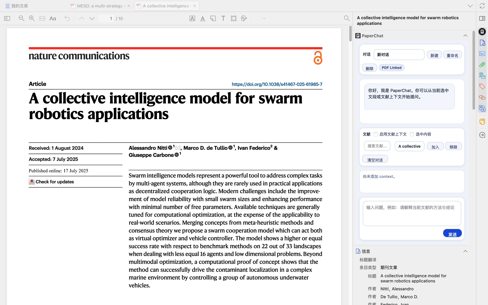
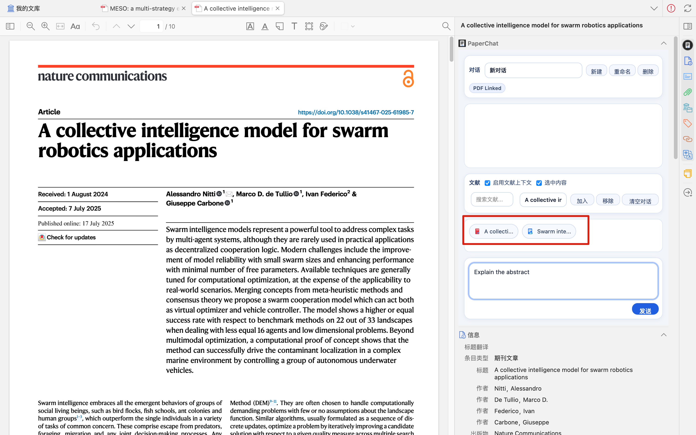

# zotero-PaperChat

PaperChat is a clean AI sidebar plugin for Zotero (only tested in Zotero 8).

## Features

- Sidebar chat UI in reader context
- Preferences-based API setup
- OpenAI-compatible `/chat/completions` request format
- Multi-PDF context management (`Add` / `Remove`, priority by recent add)
- Optional selected-text context from Zotero Reader
- Conversation management (new / switch / rename / delete)
- Typewriter-style assistant output animation
- Basic error handling for config, auth, rate limit, and server errors

## Configuration

Open Zotero Preferences -> PaperChat, then set:

- API Key
- API Endpoint (full URL ending with `/chat/completions`)
- Model Name
- Temperature (0 ~ 2)
- System Prompt

## Usage

1. Open a PDF in Zotero Reader and open the `PaperChat` sidebar.
2. (Optional) Enable `Selected Text` and highlight text in Reader.
3. Enable `Literature Context`.
4. Search a paper in the context panel, select it, and click `Add`.
5. Repeat step 4 to add multiple PDFs to context.
6. Ask questions in chat. Only items shown in the context badges are used as PDF context.

## Behavior / Limits

- Max selected PDFs per conversation: `5`
- PDF context priority: most recently added first
- Context budget policy:
  - Per document cap: `8000` chars
  - Total PDF context cap: `24000` chars
  - When over budget, lower-priority documents are compressed/truncated first
- Invalid or removed PDFs are auto-pruned from context during request building
- Context selection is stored per conversation

## Preview

1. Library and sidebar overview



2. Text selection and multi-PDF context support



3. PDF chat result


## Build

```bash
npm install
npm run build
```

## Acknowledgments

- [whiteofalien/zotero-ai-tab](https://github.com/whiteofalien/zotero-ai-tab)
- [windfollowingheart/zotero-paper-agent](https://github.com/windfollowingheart/zotero-paper-agent)
- [OpenAI Codex](https://openai.com/codex/)

## License

AGPL-3.0-or-later
